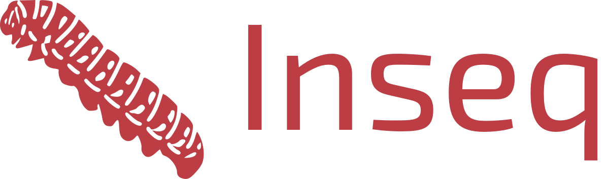

<div align="center">
  
  <h3>Intepretability for Sequence-to-sequence Models 🔍</h3>
</div>
<br/>
<div align="center">

[](https://github.com/inseq-team/inseq/actions?query=workflow%3Abuild)
<!-- [](https://pypi.org/project/inseq/) -->
[](https://github.com/inseq-team/inseq/pulls?utf8=%E2%9C%93&q=is%3Apr%20author%3Aapp%2Fdependabot)

[](https://github.com/psf/black)
[](https://github.com/PyCQA/bandit)
[](https://github.com/inseq-team/inseq/blob/master/.pre-commit-config.yaml)
[](https://github.com/inseq-team/inseq/releases)
[](https://github.com/inseq-team/inseq/blob/master/LICENSE)


</div>

## Example usage

```python
import logging
from inseq import AttributionModel, GradientAttributionOutput, heatmap

logger = logging.getLogger(__name__)
logging.basicConfig(
    level=logging.INFO,
    format="%(message)s",
)
model = inseq.load("Helsinki-NLP/opus-mt-en-it", "integrated_gradients")
sample_texts = ["Hello world, today is a good day!"]
out = model.attribute(txt, references=None, attr_pos_end=None, return_convergence_delta=True, n_steps=300)
```


## Todos

- [x] Generalize to other HF models
- [x] Generalize to other attribution methods
- [x] Add constrained attribution
- [x] Allow for batched attribution
- Integrate fairseq models

## Feature attribution steps

1. **Define model name or path and attribution method**

```python
model_name = f"Helsinki-NLP/opus-mt-en-it"
method = "integrated_gradients"
```

2. **Initialize model**

```python
model = AttributionModel.load(model_name)
```

What happens under the hood:

- Disambiguate whether it's a HF or a fairseq model and load it and the tokenizer.

- If the method is passed to the attribution model, perform the setup

3. **Attribute a sample text**

```python
text = "The ultimate test of your knowledge is your capacity to convey it to another."
out = model.attribute(text, method=method)
```

What happens under the hood:

- Check if method parameter is defined and if it matches the one at initialization. If not, replace it for this time only. If missing, use the one at initialization. If both missing, raise an error. If not currently in use, perform the setup for the attribution method.

- Check if a reference text is defined. If not, we perform a standard greedy decoding of the target (pick the highest value in the logits), else we tokenize the reference text and force the model to compute the attributions and decode the reference by picking the corresponding value in the logits.

- Return one or more FeatureAttributionOutput objects.
