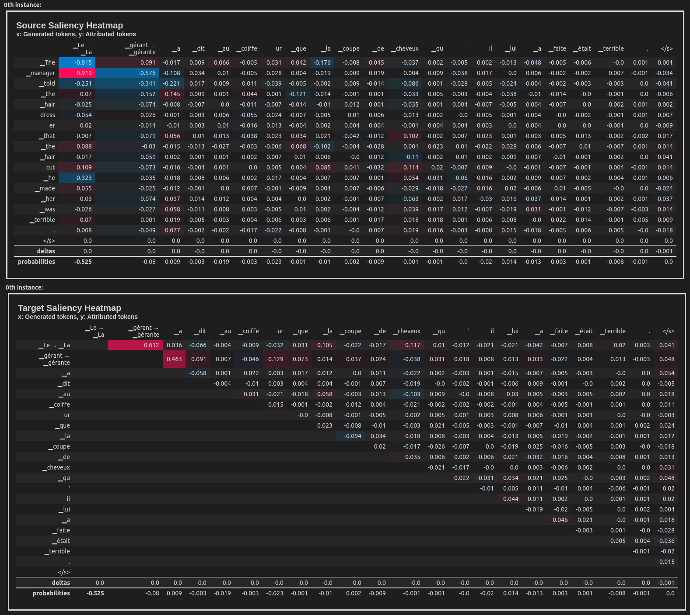

<div align="center">
  
  <h4>Intepretability for Sequence-to-sequence Models 🔍</h4>
</div>
<br/>
<div align="center">

[](https://github.com/inseq-team/inseq/actions?query=workflow%3Abuild)
[](https://pypi.org/project/inseq/)
[](https://github.com/psf/black)
[](https://github.com/inseq-team/inseq/blob/main/LICENSE)

</div>

## Example usage in Python

This example uses the Integrated Gradients attribution method to attribute the English-French translation of a sentence taken from the WinoMT corpus:

```python
import inseq

model = inseq.load_model("Helsinki-NLP/opus-mt-en-fr", "integrated_gradients")
out = model.attribute(
  "The developer argued with the designer because her idea cannot be implemented.",
  return_convergence_delta=True,
  n_steps=100
)
out.show()
```


## Using the Inseq client

See the available options by typing `inseq -h` in the terminal after installing the package.

For now, two commands are supported:

- `ìnseq attribute`: Wraps the `attribute` method shown above, requires explicit inputs to be attributed.

- `inseq attribute-dataset`: Enables attribution for a full dataset using Hugging Face `datasets.load_dataset`.

Both commands support the full range of parameters available for `attribute`, attribution visualization in the console and saving outputs to disk.

**Example:** The following command can be used to perform attribution (both source and target-side) of Italian translations for a dummy sample of 20 English sentences taken from the FLORES-101 parallel corpus, using a MarianNMT translation model from Hugging Face `transformers`. The output is shown in the console and saved to disk to `out.json` (you can load it later using `inseq.FeatureAttributionOutput.load("out.json")`).

```bash
inseq attribute-dataset \
  --model_name_or_path Helsinki-NLP/opus-mt-en-it \
  --attribution_method integrated_gradients \
  --do_prefix_attribution \
  --dataset_name inseq/dummy_enit \
  --input_text_field en \
  --dataset_split "train[:20]" \
  --save_path out.json \
  --batch_size 8
```

### Dealing with minimal pairs

Inseq support minimal pair analysis via the `PairAggregator` component. Here is an example of using `PairAggregator` to produce a heatmap containing the score difference between two `FeatureAttributionSequenceOutput` objects:


```python
import inseq
from inseq.data.aggregator import AggregatorPipeline, ContiguousSpanAggregator, SequenceAttributionAggregator, PairAggregator

# Load the EN-FR translation model and attach the IG method
model = inseq.load_model("Helsinki-NLP/opus-mt-en-fr", "integrated_gradients")

# Perform the attribution with forced decoding. Return convergence deltas, probabilities and target attributions.
out = model.attribute(
    [
        "The manager told the hairdresser that the haircut he made her was terrible.",
        "The manager told the hairdresser that the haircut he made her was terrible.",
    ],
    [
        "Le gérant a dit au coiffeur que la coupe de cheveux qu'il lui a faite était terrible.",
        "La gérante a dit au coiffeur que la coupe de cheveux qu'il lui a faite était terrible.",
    ],
    n_steps=300,
    return_convergence_delta=True,
    attribute_target=True,
    step_scores=["probability"],
    internal_batch_size=100,
    include_eos_baseline=False,
)

# Aggregation pipeline composed by two steps:
# 1. Aggregate contiguous tokens across all attribution dimensions
# 2. Aggregate the last dimension of the neuron-level attribution to make it token-level
squeezesum = AggregatorPipeline([ContiguousSpanAggregator, SequenceAttributionAggregator])

# Simply aggregate over the last dimension for the masculine variant
masculine = out.sequence_attributions[0].aggregate(aggregator=SequenceAttributionAggregator)

# For the feminine variant, we also use the contiguous span aggregator to merge "▁gérant" "e"
# in a single token to match masc shape
feminine = out.sequence_attributions[1].aggregate(aggregator=squeezesum, target_spans=(1, 3))

# Take the diff of the scores of the two attribution and show it
masculine.show(aggregator=PairAggregator, paired_attr=feminine)
```


