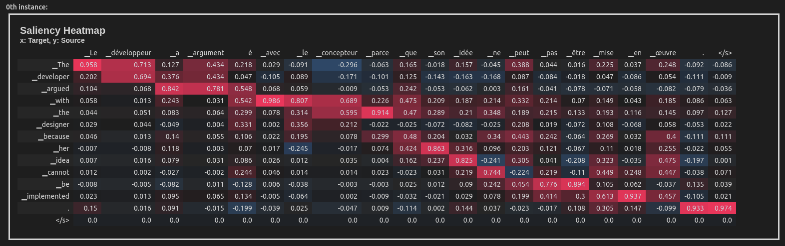
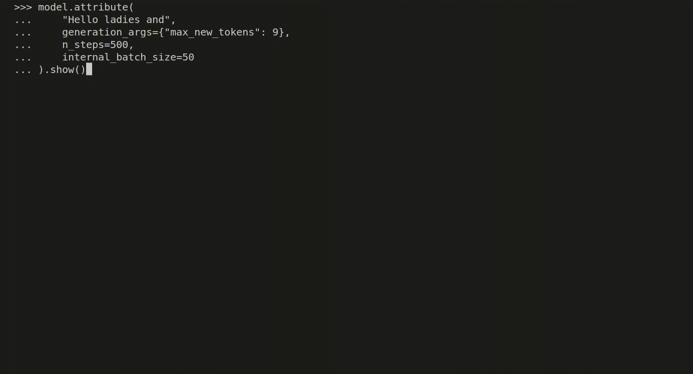
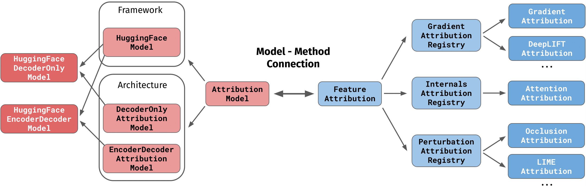

<div align="center">
  
  <h4>Intepretability for Sequence Generation Models 🔍</h4>
</div>
<br/>
<div align="center">

[](https://github.com/inseq-team/inseq/actions?query=workflow%3Abuild)
[](https://pypi.org/project/inseq/)
[](https://github.com/psf/black)
[](https://github.com/inseq-team/inseq/blob/main/LICENSE)

</div>

## Installation

To install the package, clone the repository and run the following commands:

```bash
cd inseq
make poetry-download # Download and install the Poetry package manager
make install # Installs the package and all dependencies
```

If you have a GPU available, use `make install-gpu` to install the latest `torch` version with GPU support.

For library developers, you can use the `make install-dev` command to install and its GPU-friendly counterpart `make install-dev-gpu` to install all development dependencies (quality, docs, extras).

After installation, you should be able to run `make fast-test` and `make lint` without errors.

<details>
  <summary>FAQ Installation</summary>

  - Installing the `tokenizers` package requires a Rust compiler installation. You can install Rust from [https://rustup.rs](https://rustup.rs) and add `$HOME/.cargo/env` to your PATH.

  - Installing `sentencepiece` requires various packages, install with `sudo apt-get install cmake build-essential pkg-config` or `brew install cmake gperftools pkg-config`.
</details>

## Example usage in Python

This example uses the Integrated Gradients attribution method to attribute the English-French translation of a sentence taken from the WinoMT corpus:

```python
import inseq

model = inseq.load_model("Helsinki-NLP/opus-mt-en-fr", "integrated_gradients")
out = model.attribute(
  "The developer argued with the designer because her idea cannot be implemented.",
  n_steps=100
)
out.show()
```

This produces a visualization of the attribution scores for each token in the input sentence (token-level aggregation is handled automatically). Here is what the visualization looks like inside a Jupyter Notebook:



Inseq also supports decoder-only models such as [GPT-2](https://huggingface.co/transformers/model_doc/gpt2.html), enabling usage of a variety of attribution methods and customizable settings directly from the console:

```python
import inseq

model = inseq.load_model("gpt2", "integrated_gradients")
model.attribute(
    "Hello ladies and",
    generation_args={"max_new_tokens": 9},
    n_steps=500,
    internal_batch_size=50
).show()
```



## Using the Inseq client

The Inseq library also provides useful client commands to enable repeated attribution of individual examples and even entire 🤗 datasets directly from the console. See the available options by typing `inseq -h` in the terminal after installing the package.

For now, two commands are supported:

- `ìnseq attribute`: Wraps the `attribute` method shown above, requires explicit inputs to be attributed.

- `inseq attribute-dataset`: Enables attribution for a full dataset using Hugging Face `datasets.load_dataset`.

Both commands support the full range of parameters available for `attribute`, attribution visualization in the console and saving outputs to disk.

**Example:** The following command can be used to perform attribution (both source and target-side) of Italian translations for a dummy sample of 20 English sentences taken from the FLORES-101 parallel corpus, using a MarianNMT translation model from Hugging Face `transformers`. We save the visualizations in HTML format in the file `attributions.html`. See the `--help` flag for more options.

```bash
inseq attribute-dataset \
  --model_name_or_path Helsinki-NLP/opus-mt-en-it \
  --attribution_method saliency \
  --do_prefix_attribution \
  --dataset_name inseq/dummy_enit \
  --input_text_field en \
  --dataset_split "train[:20]" \
  --viz_path attributions.html \
  --batch_size 8 \
  --hide
```

### Class structure

The following diagram provides an overview of the main classes in the library:



When `inseq.load_model` is called using a model name and feature attribution method identifier, the correct model class and the corresponding method are instantiated and tied together (the method is accessible via `model.attribution_method`).