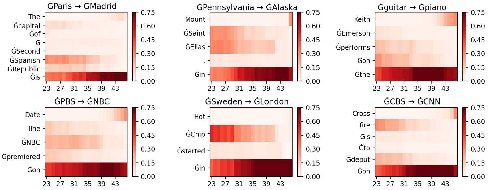

..
    Copyright 2023 The Inseq Team. All rights reserved.

    Licensed under the Apache License, Version 2.0 (the "License"); you may not use this file except in compliance with
    the License. You may obtain a copy of the License at

        http://www.apache.org/licenses/LICENSE-2.0

    Unless required by applicable law or agreed to in writing, software distributed under the License is distributed on
    an "AS IS" BASIS, WITHOUT WARRANTIES OR CONDITIONS OF ANY KIND, either express or implied. See the License for the
    specific language governing permissions and limitations under the License.

#######################################################################################################################
Locating Factual Knowledge in GPT-2
#######################################################################################################################

This example shows how to use Inseq to locate factual knowledge in GPT-2, adopting the contrastive attribution method
described in `"Interpreting Language Models with Contrastive Explanations" <https://arxiv.org/abs/2202.10419>`__ by Yin
and Neubig (2022).

Thanks to `bitsandbytes <https://github.com/TimDettmers/bitsandbytes>`__ integration, we can attribute the GPT-2 XL
model (1.5B parameters) using the ``layer_gradient_x_activation`` method on very affordable hardware (tested on a 6GB
Nvidia RTX 3060 GPU). The following code snippet loads the model and runs attribution for intermediate layers of the
model on the whole Counterfact Tracing dataset by `Meng et al. (2022) <https://openreview.net/forum?id=-h6WAS6eE4>`__,
saving aggregated outputs to disk.

.. code-block:: python

    import inseq
    from datasets import load_dataset
    from transformers import AutoModelForCausalLM, AutoTokenizer

    # The model is loaded in 8-bit on available GPUs
    model = AutoModelForCausalLM.from_pretrained("gpt2-xl", load_in_8bit=True, device_map="auto")
    tokenizer = AutoTokenizer.from_pretrained("gpt2-xl")
    # Counterfact datasets used by Meng et al. (2022)
    data = load_dataset("NeelNanda/counterfact-tracing")["train"]

    # GPT-2 XL is a Transformer model with 48 layers
    for layer in range(48):
        attrib_model = inseq.load_model(
            model,
            "layer_gradient_x_activation",
            tokenizer="gpt2-xl",
            target_layer=model.transformer.h[layer].mlp,
        )
        for i, ex in data:
            # e.g. "The capital of Spain is"
            prompt = ex["relation"].format{ex["subject"]}
            # e.g. "The capital of Spain is Madrid"
            true_answer = prompt + ex["target_true"]
            # e.g. "The capital of Spain is Paris"
            false_answer = prompt + ex["target_false"]
            contrast = attrib_model.encode(false_answer)
            # Contrastive attribution of true vs false answer
            out = attrib_model.attribute(
                prompt,
                true_answer,
                attributed_fn="contrast_logits_diff",
                contrast_ids=contrast.input_ids,
                contrast_attention_mask=contrast.attention_mask,
                step_scores=["contrast_logits_diff"],
                show_progress=False,
            )
            # Save aggregated attributions to disk
            out = out.aggregate()
            out.save(f"layer_{l}_ex_{i}.json", overwrite=True)

The following plots visualize attributions per layers for some examples taken from the dataset, showing how
intermediate layers play a relevant role in recalling factual knowledge, in relation to the last subject token in the
input:

